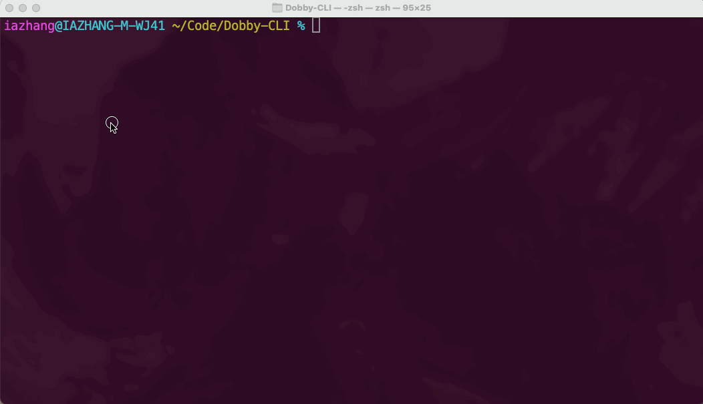

# Dobby-CLI

  

Yes, just as the name indicates, Dobby-CLI atcs like a smart house-elf who resides in the terminal and hopes to make its poor friend's life easier, especially those network engineers who struggle with remembering their CLIs.

All you need to do is to summon it in the midst of working on your Cisco switch/router, and talk to it in natural language.

  

Its capabilities include:
- Read through your Cisco device console messages on the terminal to understand your situation.
- Auto-complete or suggest what CLI you should use. Options will be available for you to choose from.
- Answer your questions with specialty in neworking engineering domain.
